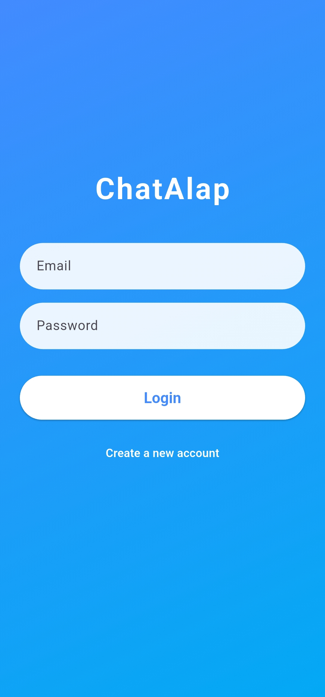
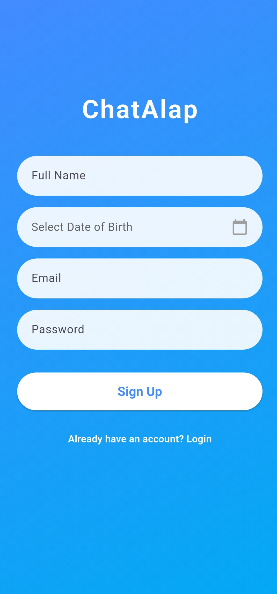

# ChatAlap 💬⚡  
A simple online messaging app built with Flutter & Firebase.  

  

---

## 📱 About the App
ChatAlap is an experimental messaging app developed to practice **Flutter UI** and **Firebase integration**.  
It allows registered users to connect and send messages to each other in real-time.  

---

## ✨ Key Features
- 🔐 **User Authentication** — Secure sign-up & login using Firebase.  
- 👥 **User List** — Browse all registered users within the app.  
- 💬 **Messaging** — Send and receive messages instantly.  
- ⚡ **Realtime Sync** — Powered by Firebase for smooth chat experience.  

---

## 🧰 Tech Stack
- **Flutter** — Cross-platform mobile development  
- **Firebase** — Firestore, Authentication  

---

## 📸 Screenshots  

  
  
  
  

---

## 🛡️ Note
> This app was created for **learning purposes**.  
> The APK and source code are private due to usage of sensitive/private APIs.  

---

## 🧑‍💻 Developer
Saifullah Anik  
🔗 [LinkedIn](https://www.linkedin.com/in/saanik/) | [GitHub](https://github.com/sanik4144)
